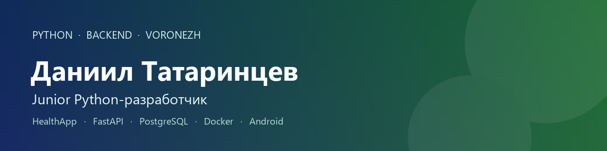

  

  
  
  
  
  

  📍 Воронеж · офис или удалёнка · открыт к позиции <b>Junior Python-разработчик</b>

## 👋 Обо мне

Пишу backend на Python и довожу задачу до рабочего сервиса: API, база, тесты и запуск в Docker. Технический контур собираю сам, поэтому могу показать не описание, а код, CI и публичную страницу продукта.

Основатель и единственный разработчик [ООО «Код Арт»](https://s1nuso1d.github.io/HealthApp/). Продукт — HealthApp, персональный дневник здоровья. Проект поддержан Фондом содействия инновациям по программе «Студенческий стартап».

🎓 Закончил Воронежский государственный технический университет, факультет информационных технологий и компьютерной безопасности.

## 🚀 Что открыть первым

| | Куда | Зачем |
| --- | --- | --- |
| 🥇 | [HealthApp](https://github.com/S1nuso1d/HealthApp) | Основной код: Android-клиент и backend |
| 🌐 | [Сайт прототипа](https://s1nuso1d.github.io/HealthApp/) | Что уже работает, без чтения репозитория |
| 📄 | [Резюме на HH.ru](https://voronezh.hh.ru/resume/fc4612b5ff0c0e35c70039ed1f674332697079) | Опыт, образование и контакты в одном файле |
| 💼 | [Хабр Карьера](https://career.habr.com/s1nuso1d) | Тот же профиль для откликов в IT |

## 💚 HealthApp

Мобильный дневник здоровья: сон, питание, вода, активность и сводка дня. Это рабочий прототип, не медицинское изделие.

Я собрал обе части:

- ⚙️ **Сервер** — FastAPI, PostgreSQL, Alembic, JWT, REST и WebSocket
- 📱 **Клиент** — Kotlin, Jetpack Compose, офлайн-очередь и синхронизация с сервером
- 🧠 **Продукт** — дневники, аналитика, ИИ-чат по записям пользователя, интеграции Open Food Facts и FatSecret
- 🧪 **Инженерия** — Docker, pytest, GitHub Actions

Публичная страница: [s1nuso1d.github.io/HealthApp](https://s1nuso1d.github.io/HealthApp/)

## 🛠️ Стек

  
  
  
  
  
  
  
  
  

## 📚 Ещё в открытом коде

Учебные проекты. Они короче HealthApp и показывают, как я разбираю отдельные задачи.

| | Проект | Что это |
| --- | --- | --- |
| 😴 | [health-project](https://github.com/S1nuso1d/health-project) | Анализ факторов сна и сравнение моделей машинного обучения |
| 🎮 | [TheGallows](https://github.com/S1nuso1d/TheGallows) | Консольная «Виселица» для двух игроков |
| ❓ | [quiz](https://github.com/S1nuso1d/quiz) | Викторина на двоих с правилами и рекордами |
| ✅ | [weeklist](https://github.com/S1nuso1d/weeklist) | Список дел на неделю: дни, задачи, отметки |
| 📅 | [calendar](https://github.com/S1nuso1d/calendar) | Календарь с расчётом високосных лет |
| 📖 | [MyBook1](https://github.com/S1nuso1d/MyBook1) | Android-приложение на Kotlin |

## 📬 Контакты

- 💬 Telegram: [@Tatarintsev_Danil](https://t.me/Tatarintsev_Danil)
- ✉️ Почта: [tatarintsev_dan1l@mail.ru](mailto:tatarintsev_dan1l@mail.ru)
- 📄 Резюме: [HH.ru](https://voronezh.hh.ru/resume/fc4612b5ff0c0e35c70039ed1f674332697079) · [Хабр Карьера](https://career.habr.com/s1nuso1d)
- 🌐 Сайт: [HealthApp](https://s1nuso1d.github.io/HealthApp/)

  
  

